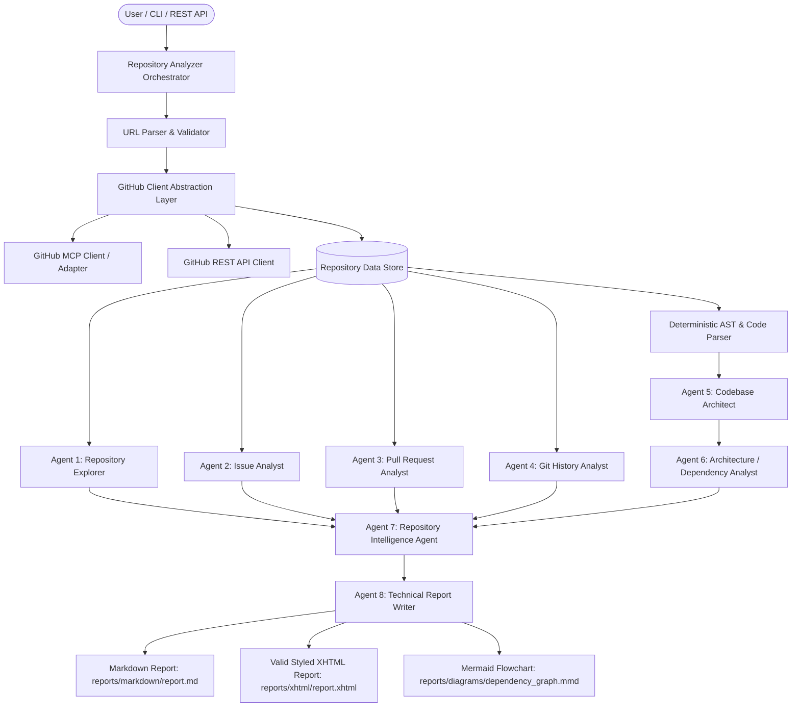
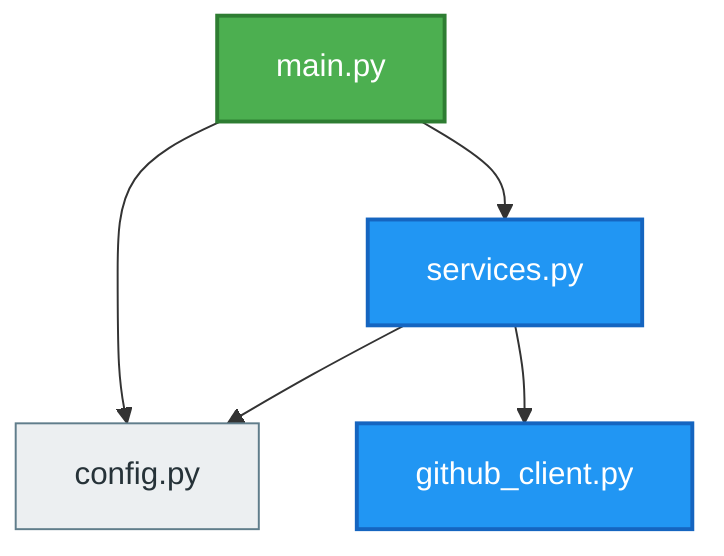

# Agentic GitHub Repository Analyzer

[](https://www.python.org/downloads/)
[](https://crewai.com)
[](https://fastapi.tiangolo.com)
[](https://modelcontextprotocol.io)
[](LICENSE)

An enterprise-grade, autonomous multi-agent software analysis platform that takes any public GitHub repository URL, conducts structural, historical, and architectural reconnaissance, and synthesizes an actionable technical health report in both **Markdown (`report.md`)** and responsive **XHTML (`report.xhtml`)** complete with live **Mermaid.js** dependency diagrams.

---

## Architecture Diagram



---

## Why CrewAI & GitHub MCP?

### Why CrewAI?
Unlike monolithic prompt pipelines or single LLM calls with huge prompts:
- **Role Specialization**: Each agent has an isolated persona, cognitive domain, and specific goal (e.g. Git Forensics vs. QA Triage vs. Systems Architecture).
- **Context Hygiene**: Downstream agents receive focused, structured domain summaries rather than raw token dumps of thousands of lines of code.
- **Hierarchical Collaboration**: Agents collaborate sequentially: raw discovery feeds telemetry analysts, whose findings feed the principal software engineer for holistic synthesis.

### Why GitHub MCP (Model Context Protocol)?
- **Tool Standardization**: Model Context Protocol standardizes repository interaction tools (`get_file_contents`, `list_directory`, `list_issues`, etc.) into a vendor-neutral protocol.
- **Pluggable Architecture**: The analyzer connects to external GitHub MCP server processes (over stdio/HTTP) when configured, or transparently bridges to GitHub REST API with exponential backoff and rate-limit tracking when running standalone.

---

## Multi-Agent Design

The system employs **8 specialized agents**:

1. **Repository Discovery Agent (`Repository Explorer`)**:
   - Validates URLs and fetches repository metadata.
   - Discovers languages, primary frameworks, config manifests (`requirements.txt`, `package.json`, `pyproject.toml`, `Dockerfile`), and likely entry points.
2. **Issue Analysis Agent (`GitHub Issue Analyst`)**:
   - Categorizes issues into bugs, feature requests, and unresolved questions.
   - Detects recurring defect patterns and triage bottlenecks.
3. **Pull Request Analysis Agent (`Pull Request Analyst`)**:
   - Inspects merge frequency, code review velocity, and detects stale PRs.
   - Flags high-risk changes and frequently modified files.
4. **Branch and Commit Agent (`Git History Analyst`)**:
   - Evaluates branch topology (active vs. stale branches).
   - Measures commit cadence and recognizes top project contributors.
5. **Code Structure Agent (`Codebase Architect`)**:
   - Deterministic AST parsing of Python, TypeScript, and JavaScript modules.
   - Catalogs classes, functions, internal module calls, and external package dependencies.
6. **Workflow & Dependency Agent (`Software Architecture Analyst`)**:
   - Builds directed dependency graphs between internal files.
   - Detects circular dependencies and outputs dynamic Mermaid.js flowcharts (`flowchart TD`).
7. **Repository Intelligence Agent (`Senior Software Engineer`)**:
   - Holistic evaluation: computes health score (0-100), identifies technical debt, assesses documentation & testing posture.
   - Formulates prioritized recommendations (`HIGH`, `MEDIUM`, `LOW`) with clear rationales.
8. **Report Generator Agent (`Technical Report Writer`)**:
   - Renders GitHub-flavored Markdown (`report.md`).
   - Renders valid, responsive W3C XHTML (`report.xhtml`) featuring interactive Mermaid diagrams, metrics cards, and badges.

---

## Technology Stack

- **Runtime**: Python 3.11+ (Tested on Python 3.13)
- **Multi-Agent Orchestration**: [CrewAI](https://github.com/crewAIInc/crewAI)
- **Protocol**: [Model Context Protocol (MCP)](https://modelcontextprotocol.io) GitHub Bridge
- **REST Client**: [HTTPX](https://www.python-httpx.org/) with connection pooling and rate-limit guardrails
- **Data Validation**: [Pydantic v2](https://docs.pydantic.dev/) & Pydantic-Settings
- **Static Analysis**: Python standard library `ast`, language lexers, and directed cycle detectors
- **Templating**: [Jinja2](https://jinja.palletsprojects.com/)
- **Visualizations**: [Mermaid.js](https://mermaid.js.org/) flowchart TD diagrams
- **API Server**: [FastAPI](https://fastapi.tiangolo.com/) and [Uvicorn](https://www.uvicorn.org/)
- **Testing**: [pytest](https://docs.pytest.org/) with unit & integration mocking

---

## Installation & Setup

### 1. Clone & Enter Repository
```bash
git clone <your-repo-url>
cd agentic-github-analyzer
```

### 2. Set Up Virtual Environment
```bash
python -m venv .venv
# On Windows:
.venv\Scripts\activate
# On Linux / macOS:
source .venv/bin/activate
```

### 3. Install Dependencies
```bash
pip install -r requirements.txt
```

### 4. Configure Environment Variables
Copy `.env.example` to `.env`:
```bash
cp .env.example .env
```
Populate `.env` with your tokens:
```ini
# Optional for public repos; recommended for 5,000 req/hr rate limits
GITHUB_TOKEN=ghp_yourPersonalAccessTokenHere

# LLM Configuration (OpenAI, Gemini, Anthropic, or Ollama)
LLM_API_KEY=your_llm_api_key_here
LLM_MODEL=gpt-4o-mini
```

> **Note**: The analyzer automatically supports **Deterministic Mode**. If no `LLM_API_KEY` is set, all AST parsing, tree scanning, issue metrics, PR churn, Mermaid graphing, and Jinja2 report compilation execute with 100% fidelity without error!

---

## GitHub MCP Configuration

To integrate with an official GitHub MCP server via stdio:

1. Install Node.js (v18+).
2. Configure `.env`:
   ```ini
   MCP_ENABLED=true
   MCP_SERVER_COMMAND=npx -y @modelcontextprotocol/server-github
   ```
3. When `MCP_SERVER_COMMAND` is set, tools route commands through the standard MCP protocol server. When omitted, the built-in MCP bridge adapts seamlessly to the direct REST API with zero external daemon requirements.

---

## Usage

### Command-Line Interface (CLI)

#### Analyze a Public Repository
```bash
python main.py --repo https://github.com/pallets/flask
```

#### Specify Custom Output Directory
```bash
python main.py --repo owner/repo --output ./custom_reports
```

#### Run in Offline Deterministic Mode (No LLM API calls)
```bash
python main.py --repo https://github.com/owner/repo --no-llm
```

#### Run Built-In Offline Demo
```bash
python main.py --mock
```

---

### FastAPI REST Server

#### Launch Server
```bash
python main.py --serve --port 8000
```
API Documentation is available interactively at `http://127.0.0.1:8000/docs`.

#### Check Health
```bash
curl http://127.0.0.1:8000/health
# {"status": "ok"}
```

#### Trigger Repository Analysis
```bash
curl -X POST http://127.0.0.1:8000/analyze \
  -H "Content-Type: application/json" \
  -d '{"repository_url": "https://github.com/pallets/flask"}'
```

Response:
```json
{
  "status": "completed",
  "repository": "pallets/flask",
  "health_score": 90,
  "health_status": "Excellent",
  "report_path": ".../reports/markdown/report.md",
  "xhtml_path": ".../reports/xhtml/report.xhtml",
  "diagram_path": ".../reports/diagrams/dependency_graph.mmd",
  "executive_summary": "The repository 'pallets/flask' is currently rated as Excellent (90/100)..."
}
```

---

## Output Artifacts

Running an analysis generates 3 primary artifacts in `reports/`:
1. `reports/markdown/report.md`: GitHub-Flavored Markdown report with tables, issue telemetry, risk breakdowns, and how-to-run instructions.
2. `reports/xhtml/report.xhtml`: Standalone, responsive W3C XHTML document with CSS styling and interactive Mermaid.js diagram viewer.
3. `reports/diagrams/dependency_graph.mmd`: Raw Mermaid flowchart TD diagram representing real file-to-file relationships.

### Example Generated Dependency Flowchart


---

## Running Automated Tests

A comprehensive unit and integration test suite is included:
```bash
pytest tests -v
```

Tests cover:
- GitHub URL parser (HTTPS, SSH, short format, error cases)
- GitHub REST API client & error handling (404, rate limits)
- Python AST code parser & JavaScript/TypeScript regex parser
- Directed dependency graph builder and cycle detector
- Jinja2 Markdown and XHTML report generator
- Full pipeline integration using mock data fixtures
- FastAPI REST endpoints (`/health`, `/analyze`)

---

## Future Improvements

- **Interactive Web Dashboard**: Streamlit or React front-end for visual drag-and-drop repo exploration.
- **Deep Security SAST**: Integration with Semgrep or Bandit for automated vulnerability scanning.
- **Multi-Repo Comparative Analytics**: Compare health scores across multiple peer repositories in an organization.
- **Automated PR Remediation**: Allow agents to generate automated pull requests fixing high-priority recommendations (e.g. generating missing README or CI workflows).
