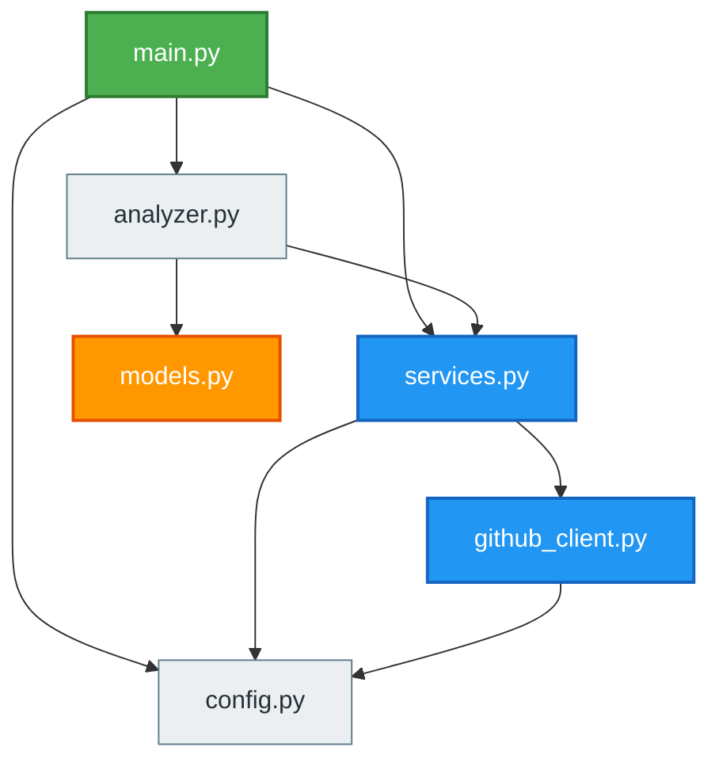

# GitHub Repository Analysis: example-org/agentic-analyzer-demo

> **Generated at:** 2026-09-10 05:46:10 UTC  
> **Analysis Duration:** 0.00s  
> **Repository Health:** **Excellent** (100/100)

---

## Executive Summary

The repository 'example-org/agentic-analyzer-demo' is currently rated as **Excellent** (100/100). Primary languages include Python, JavaScript, Dockerfile. The codebase contains 6 analyzed source modules following a Service-Oriented / MVC Architecture pattern. Activity indicators show 2 open issues and 1 open PRs.

---

## 1. Repository Overview

| Property | Value |
| :--- | :--- |
| **Repository** | `example-org/agentic-analyzer-demo` |
| **Default Branch** | `main` |
| **Stars** | 342 |
| **Forks** | 48 |
| **Open Issues / PRs** | 8 |
| **License** | MIT License |
| **Primary Languages** | Python, JavaScript, Dockerfile |
| **Key Entry Points** | main.py |
| **Config Manifests** | .env.example, Dockerfile, docker-compose.yml, requirements.txt |
| **Docker Support** | Yes |
| **CI/CD Pipeline** | Yes |

---

## 2. Issues Analysis

- **Total Issues Analyzed:** 4
- **Open Issues:** 2
- **Closed Issues:** 2
- **Issue Trends:** Stable

### Major Identified Bugs & Problems
- #101: Fix authentication timeout under high concurrency
- #95: Memory leak when scanning deep recursive directories
- #90: Login fails when password contains special characters

### Recurring Problems
- No systemic recurring patterns detected.

### Feature Requests & Enhancements
- #102: Add support for custom webhook endpoints

---

## 3. Pull Request Analysis

- **Total PRs Analyzed:** 2
- **Open PRs:** 1
- **Merged PRs:** 1
- **Closed (Unmerged) PRs:** 0
- **PR Cadence Trends:** Healthy pull request velocity

### Important Pull Requests
- PR #115: Refactor architecture and consolidate HTTP client

### Large or Risky Changes
- No high-risk PR modifications identified.

### Frequently Modified Files
- Modifications are distributed evenly across modules.

---

## 4. Branch & Git History Analysis

- **Total Branches:** 4
- **Active Branches:** main, develop
- **Stale Branches:** feature/caching, stale-experiment-2023
- **Commit Frequency:** 3 commits retrieved in recent history
- **Velocity Trends:** Moderate commit activity

### Top Contributors
- Alice Developer (2 commits in sample)
- Bob Architect (1 commits in sample)

---

## 5. Code Architecture & Structure

- **Analyzed Modules:** 6
- **Classes Count:** 5
- **Functions/Components Count:** 10
- **Architectural Style:** Service-Oriented / MVC Architecture

### Key Source Directories

---

## 6. Dependency Graph & Workflow



- **Entry Points:** main.py
- **Leaf Components:** config.py, models.py
- **Circular Dependencies:** None detected

---

## 7. Repository Intelligence & Risk Assessment

### Health Evaluation
- **Health Score:** 100 / 100 (Excellent)
- **Testing Situation:** Automated tests detected in repository.
- **Documentation Quality:** README documentation is present.
- **Maintainability:** High

### Potential Risks & Vulnerabilities
- No critical architectural or operational risks detected.

### Technical Debt
- Minimal technical debt identified in scanned files.

---

## 8. Actionable Recommendations

### High Priority
- None.

### Medium Priority
- None.

### Low Priority
- None.

---

## 9. How to Run Locally

> **Status:** *Likely execution procedure (Inferred from manifest indicators)*

### Prerequisites
- git (v2.x or higher)
- Python 3.10+ and pip
- Docker Engine & Docker Compose

### Installation Procedure
```bash
git clone https://example.org/demo
cd agentic-analyzer-demo
python -m venv .venv
# On Windows: .venv\Scripts\activate | On Linux/macOS: source .venv/bin/activate
pip install -r requirements.txt
```

### Configuration
```bash
cp .env.example .env
# Edit .env with your specific API credentials
```

### Execution
```bash
python main.py
docker compose up --build
```

---

## 10. Conclusion

Velocity is moderate commit activity with healthy pull request velocity.