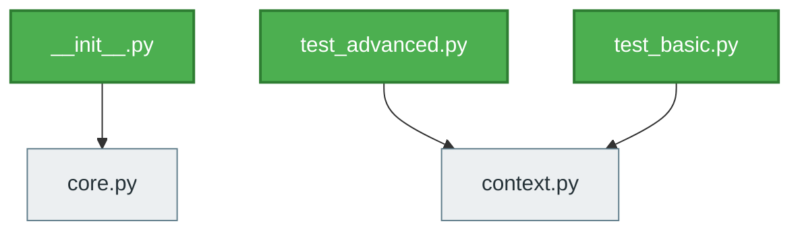

# GitHub Repository Analysis: navdeep-G/samplemod

> **Generated at:** 2026-09-10 05:47:30 UTC  
> **Analysis Duration:** 18.28s  
> **Repository Health:** **Good** (80/100)

---

## Executive Summary

The repository 'navdeep-G/samplemod' is currently rated as **Good** (80/100). Primary languages include Python, Makefile. The codebase contains 8 analyzed source modules following a Layered Architecture pattern. Activity indicators show 0 open issues and 12 open PRs.

---

## 1. Repository Overview

| Property | Value |
| :--- | :--- |
| **Repository** | `navdeep-G/samplemod` |
| **Default Branch** | `master` |
| **Stars** | 4886 |
| **Forks** | 1424 |
| **Open Issues / PRs** | 17 |
| **License** | BSD 2-Clause "Simplified" License |
| **Primary Languages** | Python, Makefile |
| **Key Entry Points** | None detected |
| **Config Manifests** | Makefile, Makefile, requirements.txt, setup.py |
| **Docker Support** | No |
| **CI/CD Pipeline** | No |

---

## 2. Issues Analysis

- **Total Issues Analyzed:** 0
- **Open Issues:** 0
- **Closed Issues:** 0
- **Issue Trends:** Stable

### Major Identified Bugs & Problems
- No recurring critical bugs detected in sampled issues.

### Recurring Problems
- No systemic recurring patterns detected.

### Feature Requests & Enhancements
- No prominent feature request backlog in sampled issues.

---

## 3. Pull Request Analysis

- **Total PRs Analyzed:** 30
- **Open PRs:** 12
- **Merged PRs:** 7
- **Closed (Unmerged) PRs:** 11
- **PR Cadence Trends:** Accumulating stale PRs awaiting review or updates

### Important Pull Requests
- No large architectural PRs currently pending.

### Large or Risky Changes
- No high-risk PR modifications identified.

### Frequently Modified Files
- Modifications are distributed evenly across modules.

---

## 4. Branch & Git History Analysis

- **Total Branches:** 1
- **Active Branches:** master
- **Stale Branches:** None detected
- **Commit Frequency:** 29 commits retrieved in recent history
- **Velocity Trends:** Active continuous commits

### Top Contributors
- Kenneth Reitz (7 commits in sample)
- Navdeep Gill (1 commits in sample)
- Dotan Nahum (1 commits in sample)
- Simon Albinsson (1 commits in sample)

---

## 5. Code Architecture & Structure

- **Analyzed Modules:** 8
- **Classes Count:** 2
- **Functions/Components Count:** 5
- **Architectural Style:** Layered Architecture

### Key Source Directories
- `docs/`
- `sample/`
- `tests/`

---

## 6. Dependency Graph & Workflow



- **Entry Points:** __init__.py, test_advanced.py, test_basic.py
- **Leaf Components:** core.py, context.py
- **Circular Dependencies:** None detected

---

## 7. Repository Intelligence & Risk Assessment

### Health Evaluation
- **Health Score:** 80 / 100 (Good)
- **Testing Situation:** Automated tests detected in repository.
- **Documentation Quality:** README documentation is present.
- **Maintainability:** High

### Potential Risks & Vulnerabilities
- ⚠️ No CI/CD automation workflow detected.

### Technical Debt
- Minimal technical debt identified in scanned files.

---

## 8. Actionable Recommendations

### High Priority
- None.

### Medium Priority
- **[CI/CD]** Configure automated GitHub Actions for build and test validation.
  - *Rationale:* Ensures continuous integration before code lands in main.
- **[Maintenance]** Address 5 stale pull requests awaiting triage.
  - *Rationale:* Prevents merge conflicts and improves contributor retention.

### Low Priority
- None.

---

## 9. How to Run Locally

> **Status:** *Likely execution procedure (Inferred from manifest indicators)*

### Prerequisites
- git (v2.x or higher)
- Python 3.10+ and pip

### Installation Procedure
```bash
git clone https://github.com/navdeep-G/samplemod
cd samplemod
python -m venv .venv
# On Windows: .venv\Scripts\activate | On Linux/macOS: source .venv/bin/activate
pip install -r requirements.txt
```

### Configuration
```bash
# No specific .env template detected
```

### Execution
```bash
python main.py
```

---

## 10. Conclusion

Velocity is active continuous commits with accumulating stale prs awaiting review or updates.