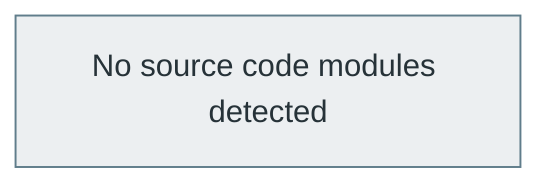

# GitHub Repository Analysis: octocat/Hello-World

> **Generated at:** 2026-09-10 05:46:48 UTC  
> **Analysis Duration:** 5.48s  
> **Repository Health:** **Critical** (40/100)

---

## Executive Summary

The repository 'octocat/Hello-World' is currently rated as **Critical** (40/100). Primary languages include Unspecified. The codebase contains 0 analyzed source modules following a Script or Flat Collection pattern. Activity indicators show 29 open issues and 17 open PRs.

---

## 1. Repository Overview

| Property | Value |
| :--- | :--- |
| **Repository** | `octocat/Hello-World` |
| **Default Branch** | `master` |
| **Stars** | 3807 |
| **Forks** | 6740 |
| **Open Issues / PRs** | 7132 |
| **License** | Not detected |
| **Primary Languages** | Unknown |
| **Key Entry Points** | None detected |
| **Config Manifests** | None |
| **Docker Support** | No |
| **CI/CD Pipeline** | No |

---

## 2. Issues Analysis

- **Total Issues Analyzed:** 30
- **Open Issues:** 29
- **Closed Issues:** 1
- **Issue Trends:** High open backlog; potential triage backlog

### Major Identified Bugs & Problems
- #11126: Test bug report

### Recurring Problems
- No systemic recurring patterns detected.

### Feature Requests & Enhancements
- No prominent feature request backlog in sampled issues.

---

## 3. Pull Request Analysis

- **Total PRs Analyzed:** 30
- **Open PRs:** 17
- **Merged PRs:** 1
- **Closed (Unmerged) PRs:** 12
- **PR Cadence Trends:** Healthy pull request velocity

### Important Pull Requests
- No large architectural PRs currently pending.

### Large or Risky Changes
- No high-risk PR modifications identified.

### Frequently Modified Files
- Modifications are distributed evenly across modules.

---

## 4. Branch & Git History Analysis

- **Total Branches:** 3
- **Active Branches:** master
- **Stale Branches:** octocat-patch-1, test
- **Commit Frequency:** 3 commits retrieved in recent history
- **Velocity Trends:** Moderate commit activity

### Top Contributors
- The Octocat (1 commits in sample)
- Johnneylee Jack Rollins (1 commits in sample)
- cameronmcefee (1 commits in sample)

---

## 5. Code Architecture & Structure

- **Analyzed Modules:** 0
- **Classes Count:** 0
- **Functions/Components Count:** 0
- **Architectural Style:** Script or Flat Collection

### Key Source Directories

---

## 6. Dependency Graph & Workflow



- **Entry Points:** None explicit
- **Leaf Components:** None
- **Circular Dependencies:** None detected

---

## 7. Repository Intelligence & Risk Assessment

### Health Evaluation
- **Health Score:** 40 / 100 (Critical)
- **Testing Situation:** No explicit test directory or automated test suite detected.
- **Documentation Quality:** Missing README file.
- **Maintainability:** Moderate

### Potential Risks & Vulnerabilities
- ⚠️ No CI/CD automation workflow detected.
- ⚠️ Project lacks basic onboarding or architectural documentation.
- ⚠️ No open-source license detected.

### Technical Debt
- 📌 Absence of automated unit/integration tests.

---

## 8. Actionable Recommendations

### High Priority
- **[Testing]** Introduce automated test suite (e.g., pytest, jest, go test).
  - *Rationale:* Unverified pull requests risk introducing regressions into production.
- **[Documentation]** Add comprehensive README.md with setup and usage instructions.
  - *Rationale:* Critical for developer onboarding and project adoption.

### Medium Priority
- **[CI/CD]** Configure automated GitHub Actions for build and test validation.
  - *Rationale:* Ensures continuous integration before code lands in main.

### Low Priority
- **[Legal / Compliance]** Declare a software license (e.g., MIT, Apache-2.0).
  - *Rationale:* Clarifies copyright and reuse terms for contributors.

---

## 9. How to Run Locally

> **Status:** *Likely execution procedure (Inferred from manifest indicators)*

### Prerequisites
- git (v2.x or higher)

### Installation Procedure
```bash
git clone https://github.com/octocat/Hello-World
cd Hello-World
```

### Configuration
```bash
# No specific .env template detected
```

### Execution
```bash
# Consult README for specific runtime commands
```

---

## 10. Conclusion

Velocity is moderate commit activity with healthy pull request velocity.